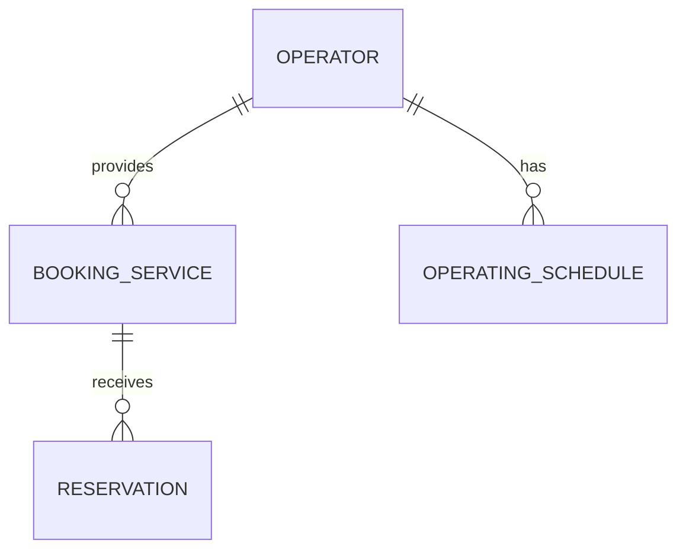

# 도메인 설계

## 범위

이 문서는 첫 MVP의 예약 도메인을 다룬다.

- 비회원 예약, 운영자별 요일 기본 운영 일정, 운영자 예약 취소를 포함한다.
- 특정 날짜 예외 일정, 고객 회원·예약 취소, 다중 직원은 MVP 범위에서 제외한다.
- 예약 가능 시간은 저장하지 않고 운영 일정, 예약 서비스, 예약을 기준으로 계산한다.

## 용어

| 용어       | 의미                                    |
| -------- | ------------------------------------- |
| 운영자      | 예약 페이지에서 예약 서비스를 제공하고 예약을 관리하는 사용자    |
| 고객       | 예약 페이지에서 예약 서비스를 예약하는 사용자             |
| 예약 페이지   | 고객이 서비스와 예약 가능 시간을 조회하고 예약하는 운영자별 페이지 |
| 예약 서비스   | 운영자가 고객에게 제공하는 예약 단위 서비스              |
| 운영 일정    | 운영자가 요일별로 설정하는 기본 운영 시간               |
| 운영 구간    | 특정 요일에 예약을 받을 수 있는 연속된 시간 범위          |
| 예약       | 고객이 예약 서비스의 시작 시각을 선택해 생성한 기록         |
| 예약 점유 시간 | 서비스 소요 시간과 준비 시간을 포함해 다른 예약을 막는 시간 범위 |

## 도메인 개념

### 운영자

- 예약 페이지, 예약 서비스, 운영 일정을 관리한다.
- 예약 현황을 조회하고 확정 예약을 취소한다.

### 예약 페이지

- 고객이 예약 서비스를 조회하고 비회원 예약을 생성하는 진입점이다.
- MVP에서는 운영자당 하나만 제공한다.
- 현재는 별도 저장 대상인지 확정하지 않는다.

### 예약 서비스

- 운영자가 제공하는 예약 단위 서비스다.
- 서비스명, 소요 시간, 서비스 종료 후 준비 시간, 예약 시작 간격, 활성 상태를 가진다.
- 한 운영자는 하나 이상의 예약 서비스를 등록할 수 있다.
- 비활성 예약 서비스는 고객 예약 페이지에서 숨기며 새 예약을 생성할 수 없다.

### 운영 일정

- 운영자에게 속하는 요일별 기본 운영 일정이다.
- 하루에는 하나의 연속된 운영 구간만 설정할 수 있다.
- 운영 일정이 없는 요일은 휴무다.

### 예약

- 고객이 선택한 예약 서비스와 시작 시각으로 생성한 기록이다.
- 고객 이름과 전화번호를 예약 정보로 직접 저장한다.
- 상태는 `확정`과 `취소`다.

## 관계

- 운영자 1:N 예약 서비스
- 운영자 1:N 운영 일정 — 각 요일에는 0개 또는 1개의 운영 일정이 있다.
- 예약 서비스 1:N 예약
- 예약 페이지는 운영자당 하나라는 제품 규칙으로 표현한다.

## 핵심 규칙

- 예약 점유 시간은 서비스 소요 시간과 준비 시간을 포함한다.
- 같은 운영자의 확정 예약 점유 시간은 서비스 종류와 무관하게 겹칠 수 없다.
- 취소된 예약은 예약 가능 시간 계산에서 제외한다.
- 예약 점유 시간은 `[시작 시각, 종료 시각)`으로 다룬다. 따라서 한 예약의 종료 시각과 다음 예약의 시작 시각이 같으면 겹치지 않는다.
- 동시 예약 요청의 원자적 보장 방식은 구현 설계 단계에서 결정한다.

## ERD

