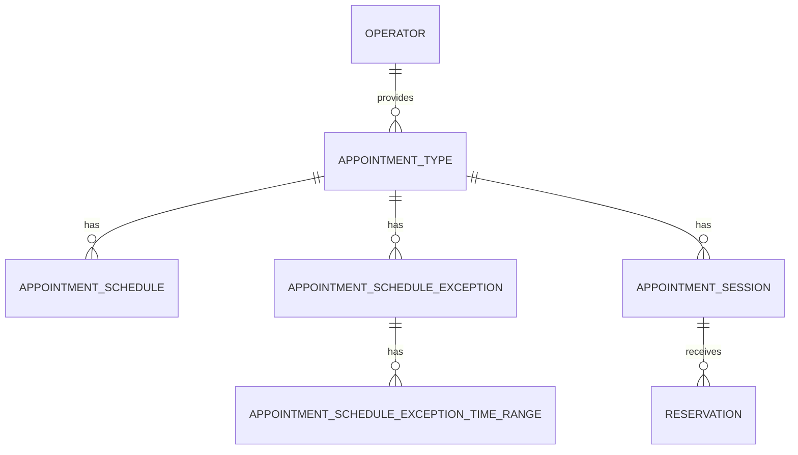

# 도메인 설계

## 범위

이 문서는 첫 MVP의 예약 도메인을 다룬다.

- 비회원 예약, 예약 유형별 반복 예약 가능 시간과 날짜 예외, 1:1 예약, 그룹 수업, 운영자 예약 취소를 포함한다.
- 그룹 수업 회차는 운영자가 날짜와 시각별로 수동 생성한다.
- 반복 회차 생성, 회차 수정, 고객 회원·예약 취소, 다중 직원은 MVP 범위에서 제외한다.
- 1:1 예약 가능 시간은 저장하지 않고 예약 유형 일정, 날짜 예외, 예약 세션을 기준으로 계산한다.

## 용어

| 용어 | 영문 모델·테이블 | 의미 |
| --- | --- | --- |
| 운영자 | `Operator` / `operators` | 예약 유형을 제공하고 예약을 관리하는 사용자 |
| 고객 | - | 예약 페이지에서 예약하는 사용자 |
| 예약 페이지 | - | 고객이 예약 유형과 예약 가능 선택지를 조회하고 예약하는 운영자별 페이지 |
| 예약 유형 | `AppointmentType` / `appointment_types` | 운영자가 제공하는 예약 단위. 1:1 또는 그룹 수업 방식 중 하나를 가진다. |
| 예약 방식 | - | 예약 유형의 방식. `1:1` 또는 `그룹 수업`이다. |
| 예약 세션 | `AppointmentSession` / `appointment_sessions` | 예약 유형의 특정 시작 시각에 실제로 열리는 예약 단위다. |
| 예약 유형 일정 | `AppointmentSchedule` / `appointment_schedules` | 예약 유형의 요일별 반복 예약 가능 시간 구간 |
| 예약 유형 일정 예외 | `AppointmentScheduleException` / `appointment_schedule_exceptions` | 특정 날짜의 휴무 또는 시간 변경 규칙 |
| 예약 유형 일정 예외 시간 구간 | `AppointmentScheduleExceptionTimeRange` / `appointment_schedule_exception_time_ranges` | 시간 변경 예외가 대체할 예약 가능 시간 구간 |
| 예약 가능 시간 구간 | - | 특정 날짜에 예약을 받을 수 있는 연속된 시간 범위 |
| 예약 | `Reservation` / `reservations` | 고객 한 명이 예약 세션에 참여하도록 생성한 기록 |
| 예약 점유 시간 | - | 예약 세션의 소요 시간과 준비 시간을 포함해 다른 예약을 막는 시간 범위 |

## 도메인 개념

### 운영자

- 예약 페이지, 예약 유형, 그룹 수업 회차를 관리한다.
- 예약 현황을 조회하고 확정 예약 또는 그룹 수업 회차를 취소한다.

### 예약 페이지

- 고객이 예약 유형을 조회하고 비회원 예약을 생성하는 진입점이다.
- MVP에서는 운영자당 하나만 제공한다.
- 현재는 별도 저장 대상인지 확정하지 않는다.

### 예약 유형

- 운영자가 제공하는 예약 단위다.
- 이름, 예약 방식, 소요 시간, 서비스 종료 후 준비 시간, 예약 시작 간격, 활성 상태를 가진다.
- 한 운영자는 하나 이상의 예약 유형을 등록할 수 있다.
- 비활성 예약 유형은 고객 예약 페이지에서 숨기며 새 예약을 생성할 수 없다.

### 예약 유형 일정

- 예약 유형에 속하는 요일별 반복 예약 가능 시간 구간이다.
- 모든 시간 구간의 시작 시각은 종료 시각보다 앞서야 한다.
- 같은 요일에는 하나 이상의 시간 구간을 둘 수 있으나 서로 겹칠 수 없다.
- 일정이 없는 요일은 해당 예약 유형을 예약할 수 없다.

### 예약 유형 일정 예외

- 예약 유형의 특정 날짜에 적용하는 예외다.
- 예약 유형과 날짜 조합에는 하나의 예외만 존재한다.
- `휴무` 예외는 해당 날짜의 예약 가능 시간을 비운다.
- `시간 변경` 예외는 해당 날짜의 반복 예약 가능 시간을 예외 시간 구간으로 대체한다.
- 시간 변경 예외의 각 시간 구간은 시작 시각이 종료 시각보다 앞서야 한다.
- 시간 변경 예외의 시간 구간은 서로 겹칠 수 없다.
- 예외가 없으면 해당 요일의 반복 예약 가능 시간 구간을 사용한다.

### 예약 세션

- 예약 유형에 속하며 시작 시각, 정원, 상태를 가진다. 상태는 `예정`과 `취소`다.
- 1:1 예약 세션은 고객의 예약 확정 시 정원 1로 생성한다. 미리 생성하지 않는다.
- 그룹 수업 예약 세션은 운영자가 그룹 수업 예약 유형에 대해 미래 시각과 정원을 지정해 생성한다.
- 그룹 수업 예약 세션은 예약자가 없어도 예정 상태인 동안 예약 가능 시간을 점유한다.

### 예약

- 고객이 예약 세션에 참여하도록 생성한 기록이다.
- 고객 이름과 전화번호를 예약 정보로 직접 저장한다.
- 상태는 `확정`과 `취소`다.
- 그룹 수업 예약 세션에는 여러 예약이 연결될 수 있지만, 확정 예약 수는 세션 정원을 초과할 수 없다.

## 관계

- 운영자 1:N 예약 유형
- 예약 유형 1:N 예약 유형 일정
- 예약 유형 1:N 예약 유형 일정 예외
- 예약 유형 일정 예외 1:N 예약 유형 일정 예외 시간 구간
- 예약 유형 1:N 예약 세션
- 예약 세션 1:N 예약
- 예약 페이지는 운영자당 하나라는 제품 규칙으로 표현한다.

## 핵심 규칙

- 예약 세션의 점유 시간은 예약 유형의 소요 시간과 준비 시간을 포함한다.
- 특정 날짜의 최종 예약 가능 시간은 해당 요일의 반복 일정 또는 날짜 예외로 결정한다. 휴무 예외는 빈 시간으로, 시간 변경 예외는 예외 시간 구간으로 처리한다.
- 1:1 예약 후보와 그룹 수업 예약 세션의 점유 시간은 하나의 최종 예약 가능 시간 구간 안에 있어야 한다.
- 같은 운영자의 예정된 예약 세션은 예약 유형과 관계없이 점유 시간이 겹칠 수 없다.
- 1:1 예약 가능 시간 계산은 확정된 1:1 예약 세션과 예정된 그룹 수업 예약 세션을 모두 제외한다.
- 취소된 예약 세션과 취소된 예약은 예약 가능 시간 및 잔여 좌석 계산에서 제외한다.
- 운영자가 그룹 수업 예약 세션을 취소하면 연결된 확정 예약도 모두 취소한다.
- 1:1 예약이 취소되면 해당 예약 세션도 취소한다.
- 예약 점유 시간은 `[시작 시각, 종료 시각)`으로 다룬다. 따라서 한 세션의 종료 시각과 다음 세션의 시작 시각이 같으면 겹치지 않는다.
- 동시 예약 요청의 원자적 보장 방식은 구현 설계 단계에서 결정한다.

## ERD

