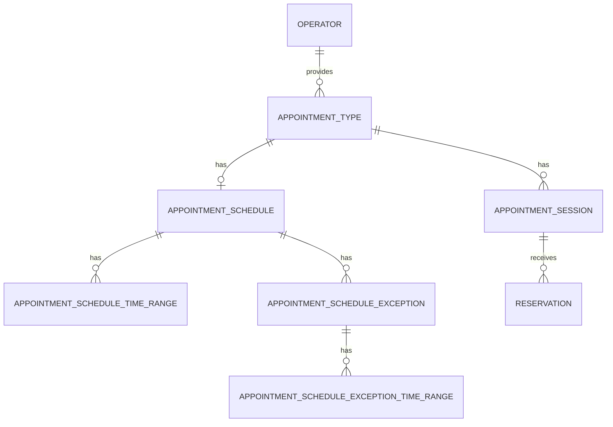

# 도메인 설계

## 범위

이 문서는 첫 MVP의 운영자 계정과 예약 도메인의 모델, 관계, 상태를 정의한다. 사용자 흐름과 검증 규칙은 각각 유스케이스와 요구사항을 원본으로 삼는다.

- 운영자 회원가입·로그인, 비회원 예약, 예약 유형별 반복 예약 가능 시간과 날짜 예외, 1:1 예약, 그룹 수업, 운영자 예약 취소를 포함한다.
- 그룹 수업 회차는 운영자가 날짜와 시각별로 수동 생성한다.
- 반복 회차 생성, 회차 수정, 고객 회원·예약 취소, 다중 직원은 MVP 범위에서 제외한다.
- 1:1 예약 가능 시간은 저장하지 않고 예약 유형 일정, 날짜 예외, 예약 세션을 기준으로 계산한다.

## 용어

| 용어 | 영문 모델·테이블 | 의미 |
| --- | --- | --- |
| 운영자 | `Operator` / `operator` | 예약 유형을 제공하고 예약을 관리하며, 자신의 계정으로 로그인하는 사용자 |
| 고객 | - | 예약 페이지에서 예약하는 사용자 |
| 예약 페이지 | - | 고객이 예약 유형과 예약 가능 선택지를 조회하고 예약하는 운영자별 페이지 |
| 예약 유형 | `AppointmentType` / `appointment_type` | 운영자가 제공하는 예약 단위. 1:1 또는 그룹 수업 방식 중 하나를 가진다. |
| 예약 방식 | - | 예약 유형의 방식. `1:1` 또는 `그룹 수업`이다. |
| 예약 세션 | `AppointmentSession` / `appointment_session` | 예약 유형의 특정 시작 시각에 실제로 열리는 예약 단위다. |
| 예약 유형 일정 | `AppointmentSchedule` / `appointment_schedule` | 예약 유형의 예약 가능 기간과 반복 일정 전체 |
| 예약 유형 일정 주간 시간 구간 | `AppointmentScheduleWeeklyTimeRange` / `appointment_schedule_weekly_time_range` | 예약 유형 일정의 요일 하나에 대한 반복 예약 가능 시간 구간 하나 |
| 예약 유형 일정 예외 | `AppointmentScheduleException` / `appointment_schedule_exception` | 예약 유형 일정의 특정 날짜 휴무 또는 시간 변경 규칙 |
| 예약 유형 일정 예외 시간 구간 | `AppointmentScheduleExceptionTimeRange` / `appointment_schedule_exception_time_range` | 시간 변경 예외가 대체할 예약 가능 시간 구간 |
| 예약 가능 시간 구간 | - | 특정 날짜에 예약을 받을 수 있는 연속된 시간 범위 |
| 예약 | `Reservation` / `reservation` | 고객 한 명이 예약 세션에 참여하도록 생성한 기록 |
| 예약 점유 시간 | - | 예약 세션의 소요 시간과 준비 시간을 포함해 다른 예약을 막는 시간 범위 |

## 도메인 개념

### 운영자

- 이름과 고유한 이메일, 로그인 자격 정보, 역할, 활성 상태를 가진다.
- 활성 상태의 운영자만 로그인할 수 있다.
- MVP의 역할은 운영자 하나이며, 운영자 역할은 운영자 전용 기능 접근 판단에 사용한다.
- 예약 유형·일정·회차·예약 현황의 개별 리소스 접근 권한은 MVP 이후에 정의한다.
- 예약 페이지, 예약 유형, 그룹 수업 회차를 관리한다.
- 예약 현황을 조회하고 확정 예약 또는 그룹 수업 회차를 취소한다.

### 예약 페이지

- 고객이 예약 유형을 조회하고 비회원 예약을 생성하는 진입점이다.
- MVP에서는 운영자당 하나만 제공한다.
- 현재는 별도 저장 대상인지 확정하지 않는다.

### 예약 유형

- 운영자가 제공하는 예약 단위다.
- 예약 방식, 소요 시간, 서비스 종료 후 준비 시간, 활성 상태를 가진다.
- 1:1 예약 유형은 예약 시작 간격을 가지며, 그룹 수업 예약 유형에는 예약 시작 간격이 없다.
- 한 운영자는 하나 이상의 예약 유형을 등록할 수 있다.

### 예약 유형 일정

- 예약 유형에 정확히 하나가 속하는 일정이다. 예약 가능 기간, 반복 일정, 날짜 예외를 가진다.
- `AppointmentScheduleWeeklyTimeRange`는 요일, 시작 시각, 종료 시각 하나를 가진다.
- 특정 날짜의 최종 예약 가능 시간은 저장하지 않고, 반복 일정과 날짜 예외로 계산한다.

### 예약 유형 일정 예외

- 예약 유형 일정의 특정 날짜에 적용하는 예외다.
- 예약 유형 일정과 날짜 조합에는 하나의 예외만 존재한다.
- `휴무` 또는 `시간 변경` 유형을 가진다.
- 시간 변경 예외는 하나 이상의 예외 시간 구간을 가진다.

### 예약 세션

- 예약 유형에 속하며 시작 시각, 정원, 상태를 가진다. 상태는 `예정`과 `취소`다.
- 1:1 예약 세션은 예약 확정과 함께 생성되며, 그룹 수업 예약 세션은 운영자가 생성한다.

### 예약

- 고객이 예약 세션에 참여하도록 생성한 기록이다.
- 고객 이름과 전화번호를 예약 정보로 직접 저장한다.
- 상태는 `확정`과 `취소`다.

## 관계

- 운영자 계정 정보와 역할은 `Operator`에 속한다.
- 운영자 1:N 예약 유형
- 예약 유형 1:1 예약 유형 일정
- 예약 유형 일정 1:N 예약 유형 일정 시간 구간
- 예약 유형 일정 1:N 예약 유형 일정 예외
- 예약 유형 일정 예외 1:N 예약 유형 일정 예외 시간 구간
- 예약 유형 1:N 예약 세션
- 예약 세션 1:N 예약
- 예약 페이지는 운영자당 하나라는 제품 규칙으로 표현한다.

## ERD

```mermaid
erDiagram
    OPERATOR ||--o{ APPOINTMENT_TYPE : provides
    APPOINTMENT_TYPE ||--o| APPOINTMENT_SCHEDULE : has
    APPOINTMENT_SCHEDULE ||--o{ APPOINTMENT_SCHEDULE_TIME_RANGE : has
    APPOINTMENT_SCHEDULE ||--o{ APPOINTMENT_SCHEDULE_EXCEPTION : has
    APPOINTMENT_SCHEDULE_EXCEPTION ||--o{ APPOINTMENT_SCHEDULE_EXCEPTION_TIME_RANGE : has
    APPOINTMENT_TYPE ||--o{ APPOINTMENT_SESSION : has
    APPOINTMENT_SESSION ||--o{ RESERVATION : receives
```
